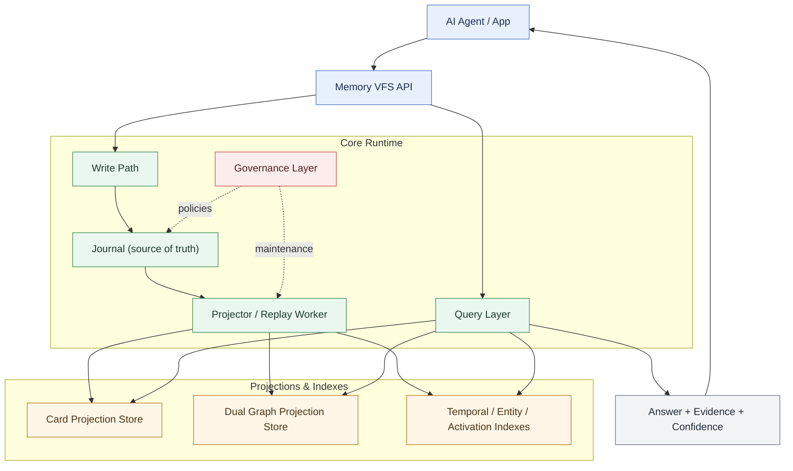
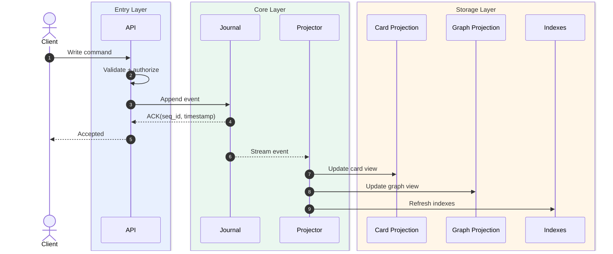
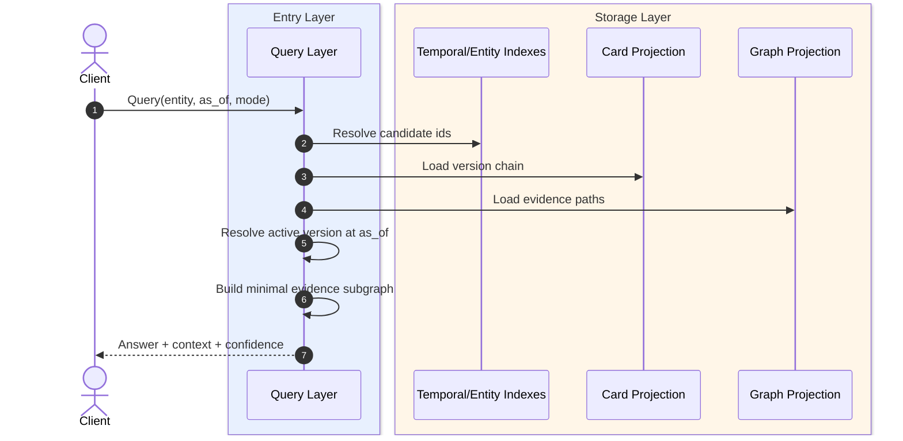
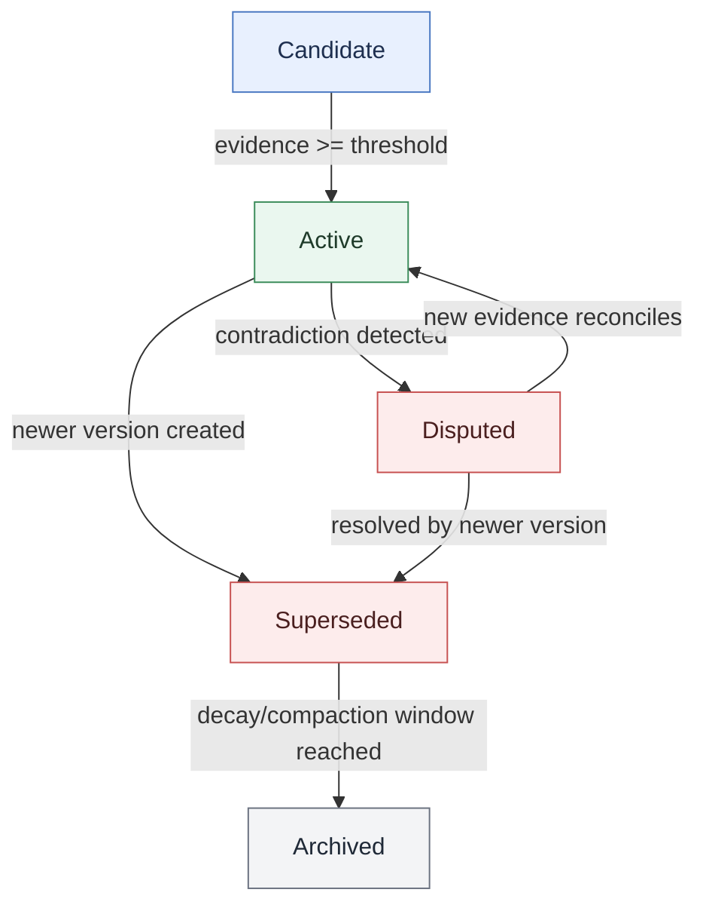

# MnemosyneOS Architecture v1

## 1. Design Principles

- Event sourced first: every memory mutation is an immutable journal event.
- Temporal correctness over convenience: queries must support "as-of T".
- Evidence before assertion: semantic facts are traceable to episodic evidence.
- Rebuildability: projections and indexes are disposable and replayable.
- Governance as core path: consolidation/decay/reconsolidation are first-class.

## 2. System Layers

### 2.1 Journal Layer (source of truth)

Responsibilities:
- Append-only event persistence.
- Ordered sequence IDs and timestamps.
- Crash-safe fsync policy.
- Replay cursor and idempotent re-processing support.

Core events:
- `CardCreated`
- `CardUpdated`
- `CardLinked`
- `CardSuperseded`
- `ActivationTouched`
- `ConsolidationApplied`
- `DecayApplied`
- `CompactionCheckpointed`

### 2.2 Card Layer (structured memory units)

Card types:
- `event` (episodic)
- `fact` (semantic)
- `preference`
- `plan`
- `goal_kernel`

Unified envelope:
- `card_id` (ULID/UUIDv7)
- `card_type`
- `created_at`
- `valid_time` (`valid_from`, `valid_to`)
- `version` (`v`, `prev_version_id`, `status`)
- `content` (typed payload)
- `evidence_refs` (list of event card ids + snippets/hash)
- `provenance` (`agent_id`, `source`, `confidence`)
- `activation_state` (`score`, `last_access_at`, `decay_policy`)

### 2.3 Dual Graph Layer

Two logical graphs over shared card IDs:
- Episodic Graph: temporal/narrative edges.
- Semantic Graph: ontology/claim edges.

Edge model:
- `edge_id`
- `from_card_id`
- `to_card_id`
- `edge_type` (e.g. `causes`, `supports`, `contradicts`, `same_as`, `about`)
- `weight` and `confidence`
- `valid_time`
- `evidence_refs`

Evidence bridge rule:
- Any semantic claim with confidence above threshold must point to at least one episodic evidence path.

### 2.4 Governance Layer

Subsystems:
- Consolidation daemon: promotes stable event patterns to fact cards.
- Reconsolidation engine: resolves conflicts and version supersession.
- Activation/decay engine: updates activation scores and archives cold memory.
- Compaction/rebuild manager: snapshots and replay checkpoints.

Policies:
- Conflict policy: keep both versions + mark one `active`, one `disputed/superseded`.
- Freshness policy: decays confidence/activation by time and access patterns.
- Safety policy: never hard-delete source evidence in hot window.

### 2.5 Query & Retrieval Layer

Query modes:
- Exact lookup (`card_id`, `entity`, `edge relation`).
- Temporal query (`as_of`, `between`).
- Evidence-backed answer (`fact + minimal evidence subgraph`).
- Narrative reconstruction (episodic chain walk).

Retrieval contract:
- Return payload plus:
  - `version_context`
  - `temporal_context`
  - `evidence_subgraph`
  - `confidence_explanation`

### 2.6 API Layer (Memory VFS)

Minimal API surface:
- `PUT /cards` create card
- `PATCH /cards/{id}` new version update
- `POST /edges` link cards
- `GET /query` filter/temporal/evidence query
- `POST /consolidate` trigger consolidation job
- `POST /rebuild` replay and projection rebuild
- `GET /health` liveness/readiness + lag metrics

### 2.7 Architecture Diagram (high-level)
Figure 1. High-Level Layered Architecture


Read guide: Top-down view of request entry, core runtime, projection/index storage, and response output.

## 3. Storage Topology

Physical stores (can start single-node):
- Journal store: append-only log segments.
- Card projection store: latest and historical versions.
- Graph projection store: adjacency index for episodic/semantic edges.
- Auxiliary indexes:
  - temporal index (`valid_from`, `valid_to`)
  - entity index
  - activation index
  - evidence reverse index

Initial implementation recommendation:
- Journal: local segment files (or embedded KV).
- Projections/indexes: embedded DB for fast local iteration.
- Keep all projection schemas replay-derivable from journal.

## 4. Core Flows

### 4.1 Write flow (ingest/update/link)
1. Validate command against card schema.
2. Append immutable event to journal.
3. Async projector updates card and graph projections.
4. Emit metrics/traces.

Write sequence:
Figure 2. Write Path Sequence


Read guide: Writes are acknowledged after journal append, then asynchronously projected into card/graph/index views.

### 4.2 Read flow (as-of/evidence)
1. Parse query + temporal constraints.
2. Read from projections.
3. Resolve version chain at `as_of`.
4. Build minimal evidence subgraph.
5. Return answer + confidence metadata.

Read sequence:
Figure 3. Read Path Sequence


Read guide: Reads resolve candidates from indexes, then assemble version-correct answers with evidence context.

### 4.3 Consolidation flow
1. Scan recent episodic patterns.
2. Propose candidate fact cards.
3. Attach evidence chain.
4. Write consolidation events.
5. Re-score related nodes/edges.

### 4.4 Reconsolidation flow
1. Detect contradictions by entity/time overlap.
2. Create new superseding fact version.
3. Mark prior version status and keep lineage.
4. Preserve both for audit and temporal querying.

Fact lifecycle:
Figure 4. Fact Version Lifecycle


Read guide: Facts move from candidate to active, then to disputed/superseded, and finally archived by governance policy.

## 5. Reliability & Observability

Reliability:
- At-least-once projection with idempotent handlers.
- Replay from checkpoint after crash.
- Deterministic projector outputs for same event stream.

Observability:
- Metrics: append latency, projector lag, query p95, conflict rate, decay rate.
- Tracing: command -> journal append -> projection update -> query path.
- Auditing: every returned fact has resolvable event lineage.

## 6. Security & Multi-Agent Isolation

- Namespace key: `tenant_id + agent_id`.
- Access control at query and mutation boundaries.
- Encryption at rest for journal segments (phase 2+).
- Redaction support via tombstone overlay (without breaking audit chain).

## 7. Suggested Codebase Layout

```text
mnemosyneos/
├── core/
│   ├── journal/
│   ├── cards/
│   ├── graph/
│   ├── activation/
│   ├── consolidation/
│   └── governance/
├── api/
│   └── memory_vfs/
├── benchmarks/
└── docs/
    ├── design/
    ├── research/
    └── benchmarks/
```

## 8. MVP Boundary (Phase 1 target)

Must-have:
- Append-only journal + replay.
- Card create/update with version chain.
- Dual graph link creation.
- Basic temporal query (`as_of`).
- Evidence pointer support.

Can defer:
- Advanced decay policies.
- Full compaction.
- Horizontal sharding.
- Complex ontology management.

## 9. Open Decisions

- Storage engine choice for local-first MVP.
- Event schema serialization format.
- Consistency model between write ACK and projection visibility.
- Confidence scoring formula and decay parameters.
- Evidence snippet hashing and immutable anchoring strategy.
